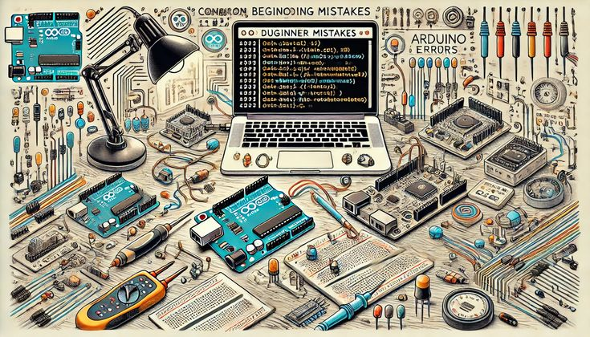
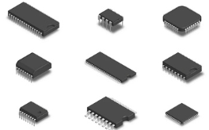
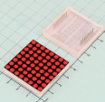
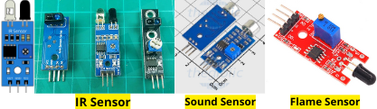
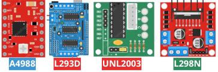
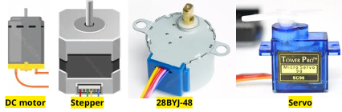
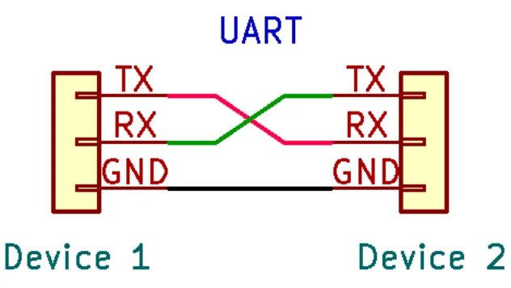
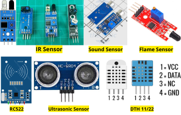

## Hello my friend 😆😆😆
```markdown
Hello đây là Roadmap của bản thân tôi ✅
Hãy cùng tham khảo nếu bạn cũng muốn học tập với lập trình nhúng. 
Chúc bạn thành công với sự lựa chọn của mình. 
# Nếu cần giúp đỡ hãy liên hệ: 0392176769 💌
Cảm ơn vì sự ghé thăm của bạn 🥰
```
🔔📢📢📢 Giới thiệu qua về FILE này:
  1. Có một số tài liệu sẽ được cập nhật dần theo thời gian để bạn tìm hiểu.
  2. Một lộ trình nhỏ để bạn bám theo khi còn mới và chưa biết nên làm gì.
  3. Hãy đọc kĩ lộ trình nhỏ này vì nó khá là quan trọng:
- Tôi chia ra 4 mục nhỏ trong mỗi giai đoạn
-    🔎 Nên tìm hiểu điều gì ---> Gợi ý cho bạn tìm hiểu ---> Gợi ý bạn nên tìm hiều điều đó như nào ---> Một số bài tập nhỏ bạn có thể làm sau khi tìm hiểu xong 🖍️🖍️🖍️
```markdown
# CHÚ Ý: Điều quan trọng nhất của bạn 
# Ngay bây giờ, tạo 1 repo GitHub lưu lại toàn bộ tài liệu trong quá trình học của bạn
```
- `# HÃY CỐ GẮNG LÊN NHÉ 🥳🥳🥳` 

# 🚀 ROADMAP HỌC LẬP TRÌNH NHÚNG
## 🗂️ Tài liệu để tham khảo 
0// ROADMAP : Hãy tìm ra một con đường cho bản thân 💫💯💯💯💫
- [Roadmap](https://roadmap.sh/)
- [Embedded-Engineering-Roadmap](https://github.com/m3y54m/Embedded-Engineering-Roadmap)

1// ARDUINO : Một số mạch cơ bản để bạn có thể bắt đầu và làm quen.🧐
- [Tài liệu tham khảo Arduino](https://www.arduino.cc/reference/en/)
- [SunFounder](https://docs.sunfounder.com/en/latest/)
- [LastMinute ENGINEERS](https://lastminuteengineers.com/)
- [CirCuits DIY](https://www.circuits-diy.com/)

2// ESP32 : Một số mạch nâng cao hơn nhờ khả năng giao tiếp không dây.📡📡📡
- [Espressif](https://www.espressif.com/en/support/documents/technical-documents)
- [Random Nerd Tutorials](https://randomnerdtutorials.com/)

3// Phần tài liệu chung : Phần này sẽ đẩy một số link có nhiều dự án để bạn có thể làm theo🗒️
- [Hackster](https://www.hackster.io/channels)
- [Instructables](https://www.instructables.com/)

4// Mô phỏng linh kiện : Rất quan trọng, bạn có thể học tập và mô phỏng ngay trên web khi chưa có phần cứng 👻👻👻
- [Tinker CAD](https://www.tinkercad.com/)
- [WokWi](https://wokwi.com/)
- [Fritzing](https://fritzing.org/)
- Proteus, Altium,.....

5// STM
6// PLC
7// Computer Vision


## 📌 MỤC LỤC
- [🔹 GIAI ĐOẠN 1 – LÀM QUEN LẬP TRÌNH & PHẦN CỨNG CƠ BẢN](#-giai-đoạn-1--làm-quen-lập-trình--phần-cứng-cơ-bản)
- [🔸 GIAI ĐOẠN 2 – THỰC HÀNH MỞ RỘNG VÀ TƯ DUY](#-giai-đoạn-2--thực-hành-mở-rộng-và-tư-duy)
- [🔷 GIAI ĐOẠN 3 – LÀM VIỆC VỚI CẢM BIẾN & ỨNG DỤNG THỰC TẾ](#-giai-đoạn-3--làm-việc-với-cảm-biến--ứng-dụng-thực-tế)
- [🔶 GIAI ĐOẠN 4 – TÌM HIỂU CÁC KẾT NỐI KHÔNG DÂY](#-giai-đoạn-4--esp32--kết-nối-không-dây)
- [🔶 GIAI ĐOẠN 5 – ĐỒNG HÀNH CÙNG TÔI 😆](#-Hello-my-friend)
- [🔴 PHỤ LỤC – CẤU TRÚC BÁO CÁO DỰ ÁN MẪU 📖📖📖](#-phụ-lục--cấu-trúc-báo-cáo-dự-án-mẫu)

---


# 🔹 GIAI ĐOẠN 1 – LÀM QUEN LẬP TRÌNH & PHẦN CỨNG CƠ BẢN



## 1. Nên tìm hiểu điều gì?
- Ngôn ngữ lập trình C cơ bản.
- Làm quen Arduino Uno / Nano (sơ đồ chân, vai trò các chân).
- Hiểu rõ sơ đồ chân Arduino, các loại chân (Digital / Analog / PWM / GND / Vin / ...), vai trò của chúng.
- Thực hành lập trình cơ bản: LED, nút nhấn, biến trở, buzzer,...

```markdown
# Quan trọng:
Làm quen Serial Monitor để in giá trị và debug.
Làm quen GitHub, tư duy tổ chức dự án cá nhân.
```

## 2. Gợi ý tìm hiểu
- C: kiểu dữ liệu, mảng, con trỏ, hàm, điều kiện, vòng lặp,...
- Hàm: định nghĩa, truyền tham số, trả giá trị.
- Arduino: pinMode(), digitalWrite(), digitalRead(), analogRead(), Serial.begin(), Serial.print()
- Các loại chân Digital / PWM / Analog trên các mạch Arduino Uno/ Arduino Nano.
- Sơ đồ chân của Arduino Uno / Nano: học kỹ từ datasheet.
- Linh kiện cơ bản: LED, button, biến trở, buzzer, cảm biến ánh sáng (LDR),...

```markdown
# CHÚ Ý: Làm quen tư duy tách code ra thành hàm con, viết rõ ràng – dễ hiểu ‼️
```
🔝 [Trở về đầu trang](#-mục-lục)

## 3. Câu hỏi gợi ý tìm hiểu

```markdown
 1  - Arduino Uno và Nano có gì khác nhau?
 2  - Mỗi loại mạch có bao nhiêu chân digital, analog, PWM?
 3  - Sơ đồ chân Arduino có ý nghĩa gì?
 4  - Các tín hiệu Analog – Digital có ưu nhược điểm gì?
 5  - Cần dùng lệnh pinMode() để làm gì? Khi nào nên dùng INPUT_PULLUP?
        ✅Hiểu cơ chế của pin đầu vào (floating, nhiễu) và cách ổn định.
        
 6  - delay() có nhược điểm gì? Khi nào không nên dùng delay()? 
 7  - Làm sao để tạo một hàm delay không chặn (non-blocking delay)? 
 8  - Làm sao để debounce (chống rung) nút nhấn? → Debounce là gì?
 9  - Debounce là gì? Có các cách debounce nào (delay, millis, thư viện)?
 10  - Tại sao nên tách chương trình thành nhiều hàm nhỏ?
 11  - Serial Monitor là gì? Dùng khi nào? Làm sao để gửi dữ liệu từ Arduino về máy tính? 
        ✅Tìm hiểu Serial.begin(), tốc độ baudrate, Serial.print()...  
        
 12  - Cách đo điện áp từ biến trở?
 13  - Nối LED sao cho đúng? Vì sao cần điện trở?
 14  - Làm sao để điều chỉnh độ sáng LED?
```
[Nếu bạn thấy nên bổ sung điều gì, làm ơn hãy nói với tôi nhé. 💌](https://www.facebook.com/HUYNLNG/)


## 4. Một số bài tập / ứng dụng nên làm:
1. Nhấn nút bật/tắt LED.
2. Debounce nút nhấn.
3. Điều chỉnh độ sáng LED bằng biến trở.
4. Phát âm thanh đơn giản với buzzer.
5. LED nhấp nháy không dùng delay.
6. Đọc giá trị LDR và hiển thị lên Serial Monitor.
7. Đếm số lần nhấn nút và in ra Serial.
8. Làm đồng hồ không blocking sử dụng millis().
9. Còi báo sáng – LDR + Buzzer.

```markdown
# Quan trọng:
   1. Mô phỏng mạch điện bằng Proteus.
   2. Tạo 1 repo GitHub lưu lại toàn bộ code và mô phỏng của bạn.
```
🔝 [Trở về đầu trang](#-mục-lục)

---

# 🔸 GIAI ĐOẠN 2 – THỰC HÀNH MỞ RỘNG VÀ TƯ DUY


## 1. Nên tìm hiểu điều gì?
- Các IC cơ bản và phân loại chúng.
- Làm việc với nhiều module phổ biến.
- Cấu trúc chương trình nhiều file, chia thư viện.
```markdown
# CHÚ Ý: Học về I2C, SPI, UART ‼️
```

## 2. Gợi ý tìm hiểu
1- IC Logic: AND, OR, NOT,...
  - [Relay logic](https://www.relaiscomputer.nl/index.php/elements)

---

2- IC Shift Register: 74HC595



  - [74HC595 - SunFounder ](https://docs.sunfounder.com/projects/beginners-lab-kit/en/latest/24_flowing_light.html)
  - [74HC595 - LastMinute ENGINEERS ](https://lastminuteengineers.com/74hc595-shift-register-arduino-tutorial/)
  - [74HC595 - Instructables ](https://www.instructables.com/search/?q=74hc595&projects=featured)
```markdown
# CHÚ Ý: Nên tìm các từ khóa liên quan tới LED, LED matrix, mở rộng chân ARduino,...‼️
```

---

3- IC Timer: NE555
  - [NE555 - Circuits DIY ](https://www.circuits-diy.com/?s=Ne555)
  - [NE555 - Instructables ](https://www.instructables.com/search/?q=ne555&projects=featured)
  - [NE555 - Hackster ](https://www.hackster.io/search?i=projects&q=ne555)

```markdown
# CHÚ Ý: Nên làm các mạch đơn giản trước như nháy LED, điều khiển động cơ,...‼️
```
🔝 [Trở về đầu trang](#-mục-lục)

---

4- IC Đếm: CD4017
  - [CD4017 - Circuits DIY ](https://www.circuits-diy.com/?s=Cd4017)
  - [CD4017 - Instructables ](https://www.instructables.com/search/?q=cd4017&projects=featured)
```markdown
# CHÚ Ý: Có thể kết hợp với một số IC khác, điển hình như Ne555 ở phía trên‼️
```
---

5- IC Comparator: LM393



  - [LM393 - Circuits DIY ](https://www.circuits-diy.com/?s=Lm393+)
```markdown
# CHÚ Ý:
 1. IC này thường nằm trong các cảm biến, như Ir Sensor, cảm biến lửa, cảm biến âm thanh,...‼️
 2. IC này có liên quan tới OA (Op-Amps), hãy tìm hiểu nó trước, nó rất có ích cho bạn‼️
```
🔝 [Trở về đầu trang](#-mục-lục)

---

6- IC Driver: ULN2003, L298N, L293D, A4988, BTS7960,...
  - [UNL2003 - LastMinute ENGINEERS ](https://lastminuteengineers.com/28byj48-stepper-motor-arduino-tutorial/)
  - [L298N - LastMinute ENGINEERS ](https://lastminuteengineers.com/l298n-dc-stepper-driver-arduino-tutorial/)
  - [L293D- LastMinute ENGINEERS - DC motor ](https://lastminuteengineers.com/l293d-dc-motor-arduino-tutorial/)
  - [L293D - LastMinute ENGINEERS - StepperAndServo ](https://lastminuteengineers.com/l293d-motor-driver-shield-arduino-tutorial/)
  - [A4988- LastMinute ENGINEERS - Stepper ](https://lastminuteengineers.com/a4988-stepper-motor-driver-arduino-tutorial/)


```markdown
# CHÚ Ý:
# Quan trọng: Cần tìm hiểu rõ về mạch cầu H.
 1. Các Driver này cần phải có nếu bạn muốn điều khiển động cơ với Vi điều khiển‼️
 2. Mỗi loại động cơ sẽ có một vài loại Driver điều khiển theo cách khác nhau‼️
 3. Hãy tìm hiểu thật kĩ về điện áp và dòng điện của mỗi loại Driver‼️
 4. Nếu được hãy tự thiết kế mạch với các IC rời nổi bật như UNL2003, L293D‼️
 5. BTS 7960 là một loại Driver đặc biệt, thường dùng với các loại động cơ lớn, cần dòng và điện áp cao‼️
 6. UNL2003 thường dùng để điều khiển 28BYJ-48 Stepper ‼️
```


---

7- IC nguồn: AMS1117, TP4056
```markdown
# CHÚ Ý:
 1. Có thể tìm hiểu liên quan tới các mạch sạc pin‼️
 2. Như TP4056 là một mạch sạc pin Lithium giá rẻ, rất nổi bật trong các dự án ‼️
```
---
8- IC giao tiếp: CH340, CP2102
```markdown
# CHÚ Ý:
 1.  Tìm hiểu cách nạp code với Arduino là bạn sẽ biết cần tải Driver có tên như này‼️
 2. Những IC này thường liên quan tới các giao thức truyền tải như UART,... ‼️
```



---

## 3. Câu hỏi gợi ý tìm hiểu
1. Sự khác nhau giữa 74HC595 và 74HC165?
2. Cách hoạt động của IC NE555 ở chế độ monostable và astable?
3. Driver L298N khác gì ULN2003?
4. Khi nào nên dùng IC shift register?
5. SPI/I2C/UART là gì? Khác nhau?

## 4. Bài tập / ứng dụng:
```markdown
 1. Điều khiển nhiều LED bằng 74HC595.
 2. Làm đồng hồ NE555 + CD4017.
 3. Giao tiếp I2C đọc nhiệt độ từ cảm biến.
 4. Điều khiển step motor qua DRV8825.
 5. Giao tiếp UART giữa hai board Arduino.
```

🔝 [Trở về đầu trang](#-mục-lục)

---

# 🔷 GIAI ĐOẠN 3 – LÀM VIỆC VỚI CẢM BIẾN & ỨNG DỤNG THỰC TẾ

## 1. Nên tìm hiểu điều gì?



- Cảm biến siêu âm, DHT11/22, MPU6050, MQ-x, RC522, IR sensor...

```markdown
# Quan trọng:
 1. Nguyên lý và cách kết nối.
 2. Cách thu thập, xử lý, lọc tín hiệu.
```

## 2. Gợi ý tìm hiểu
- Giao tiếp từng loại cảm biến
- Lọc nhiễu dữ liệu cảm biến (moving average, median filter, Kalman filter, madgwick filter...)
```markdown
# Quan trọng:
 1. Giới hạn đo, độ chính xác, sai số.
 2. Giao tiếp SPI/I2C/UART tương ứng.
```

## 3. Câu hỏi gợi ý tìm hiểu
1. Cảm biến nào phù hợp đo khoảng cách? Nhiệt độ? Khí gas?
2. Tín hiệu cảm biến thường bị nhiễu, xử lý sao?
3. Sự khác biệt giữa DHT11 và DHT22?
4. IR Sensor hoạt động như thế nào?

## 4. Ứng dụng nên làm:
```markdown
 1. Tìm hiểu màn hình đơn giản như LCD1602.
 2. Đo khoảng cách và hiển thị LCD.
 3. Đọc nhiệt độ – độ ẩm từ DHT11.
 4. Đọc thẻ RFID để mở cửa.
 5. Hệ thống phát hiện vật cản bằng IR + buzzer.
```

🔝 [Trở về đầu trang](#-mục-lục)

---

# 🔶 GIAI ĐOẠN 4 – ESP32 & KẾT NỐI KHÔNG DÂY


## 1. Nên tìm hiểu điều gì?
- Kiến trúc ESP32 và cách dùng  [ESP32 - SunFounder ](https://docs.sunfounder.com/projects/esp32-starter-kit/en/latest/)
- Kết nối WiFi, Bluetooth
- [MQTT - SunFounder ](https://docs.sunfounder.com/projects/esp32-starter-kit/en/latest/arduino/iot_projects/ar_iot_mqtt.html)
- [Blynk ](https://blynk.io/)
- [E-ra IOT ](https://e-ra.io/index.html)
```markdown
# Quan trọng:
 1. Giao tiếp MQTT, WebServer đơn giản.
 2. Tìm hiểu cách giao tiếp không dây giữa ESP32 với cảm biến qua Blynk, E-ra.
 3. Sau khi ổn các mục trên có thể tìm hiểu thêm OTA update, SPIFFS, Firebase.
```
🔝 [Trở về đầu trang](#-mục-lục)

## 2. Gợi ý tìm hiểu
- Cách nạp code vào ESP32 bằng Arduino IDE.
- Cấu hình kết nối WiFi cơ bản.
- Giao tiếp MQTT publish/subscribe.
- Tạo web server cơ bản trên ESP32.
- OTA cập nhật từ xa.
- Tải lên SPIFFS hoặc LittleFS.
```markdown
# Quan trọng:
 1. Cấu hình Wifi cho Esp chế độ Phát và Thu HOẶC vừa Phát sóng vừa Thu sóng.
 1. Tạo web server để tương tác với Esp32 và cảm biến từ xa.
 2. Cách nạp code cho ESP32 có thể gặp lỗi, liên quan tới việc nhấn giữ nút BOOT trên ESP khi nạp.
```

## 3. Câu hỏi gợi ý tìm hiểu
Tài liệu: [Espressif](https://www.espressif.com/en/support/documents/technical-documents)
1. ESP32 có mấy core? Tốc độ xử lý? So với Uno thì hơn kém ở đâu?
2. Làm sao để kết nối ESP32 vào WiFi?
3. WebServer hoạt động thế nào trên ESP32?
4. MQTT khác HTTP chỗ nào? Khi nào nên dùng?
5. Cách OTA cập nhật phần mềm từ xa.

## 4. Bài tập:
```markdown
 1. Kết nối và Cấu hình Wifi cho ESP32.
 2. Phân biệt các loại ESP32, chức năng. RAM, ROM của chúng‼️
 3. Làm quen và tìm hiểu Blynk, E-ra để làm một số dự án mini như bật tắt LED từ xa bằng ESP32,...
 4. Xây dựng WebServer với ESP32 điều khiển LED.
 5. Tìm hiểu về Firebase với ESP32.
 6. Sử dụng MQTT để giao tiếp giữa các thiết bị.
```

🔝 [Trở về đầu trang](#-mục-lục)

---

# 🔴 PHỤ LỤC – CẤU TRÚC BÁO CÁO DỰ ÁN MẪU
‼️ Nếu bạn muốn tốt hơn sau khi tìm hiểu mỗi linh kiện.
 - Tôi nghĩ chúng ta có thể làm một Slide, 1 bản báo cáo nhỏ như đang trình bày cho người khác với mẫu như bên dưới.
  
📢 Nếu làm mỗi bản báo cáo nhỏ sau mỗi lần tìm hiểu bạn sẽ có rất nhiều lợi ích:
   1. Cả một kho tài liệu của riêng bản thân.
   2. Dễ tìm lại và học lại hơn.
   3. Hiểu sâu, hiểu rõ, nhớ rõ những thứ mình đã nghiên cứu hơn so với không làm.
   4. Cố gắng làm bản báo cáo như bạn đang dạy người khác là bạn đang dạy lại chính bản thân mình.
   5. `# Chúc bạn may mắn với lựa chọn của bản thân 💫💫💫`

```markdown
# Cấu trúc báo cáo 📝📝📝:
1  - Tên dự án bạn làm. 🪪
2  - Mục tiêu, tại sao bạn lại tìm hiểu dự án này.
3  - Danh sách linh kiện, tài liệu mà bạn sử dụng, nghiên cứu trong dự án. 📒📒📒
4  - Sơ đồ nguyên lý hoặc sơ đồ nối dây của linh kiện bạn đang tìm hiểu. 
5  - Mã nguồn chương trình, code nếu có trong linh kiện bạn đang tìm hiểu (ghi chú rõ ràng, nếu có). 💻
6  - Hình ảnh hoặc video minh họa. 📸📸📸
7  - Khó khăn gặp phải và cách giải quyết, các mặt trái và mặt lợi trong dự án bạn làm.💡
8  - Gợi ý phát triển tiếp theo, ứng dụng của dự án đó trong thực tế.💡
9  - Tổng kết, học hỏi, lưu trữ được gì sau khi tìm hiểu dự án đó ❓
10 - Rà soát lại tất cả và HÃY LƯU TRỮ lại nhé 📲😁😁😁


